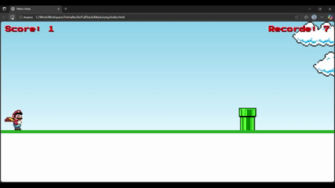

# Mario Jump 🎮

Mario Jump é um jogo de navegador inspirado no clássico Super Mario, onde o jogador controla o Mario e precisa pular obstáculos (canos) para ganhar pontos. O jogo registra o Score e o Recorde do jogador usando o `localStorage`, permitindo que o recorde seja mantido mesmo após atualizar a página.

---

## 🕹️ Como Jogar

- Pressione qualquer tecla para fazer o Mario pular.  
- Evite bater nos canos que aparecem na tela.  
- Cada cano ultrapassado aumenta o seu **Score**.  
- Se o Mario colidir com um cano, o jogo termina, mas o **Recorde** é salvo.

---

## ⚙️ Tecnologias Usadas

- HTML5
- CSS3
- JavaScript
- Fonte estilo Super Mario: [Press Start 2P](https://fonts.google.com/specimen/Press+Start+2P)

---

## 📂 Estrutura do Projeto
Mario-Jump/
│
├── index.html # Estrutura do jogo
├── css/
│ └── style.css # Estilos do jogo, animações e Score/High Score
├── js/
│ └── script.js # Lógica do Mario, colisão e pontuação
└── Images/
├── clouds.png
├── mario.gif
├── pipe.png
└── game-over.png

## Funcionalidades Extras

- Score e Recorde com fonte estilo Super Mario (Press Start 2P).
- Contorno preto no texto para melhor visualização.
- Nuvens se movendo no fundo para dar sensação de movimento.
- O jogo continua acumulando Score indefinidamente até o Mario colidir.

---

## 🎮 Demo do Jogo



## 💻 Como Executar

Clone o repositório:
```bash
git clone https://github.com/seu-usuario/mario-jump.git

